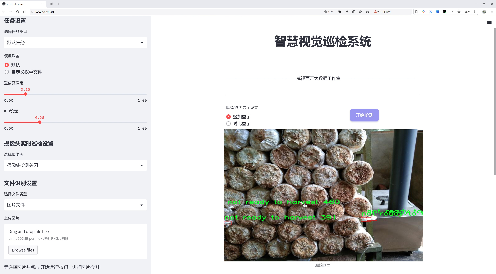
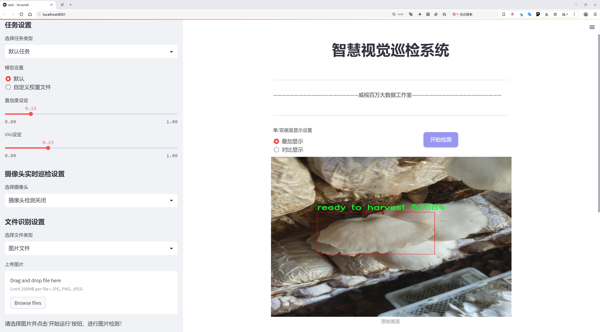
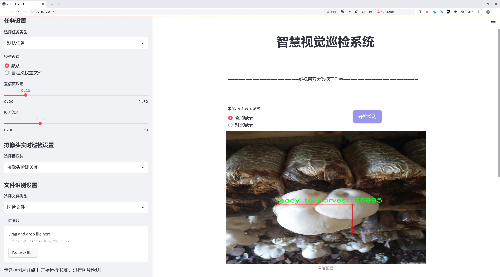
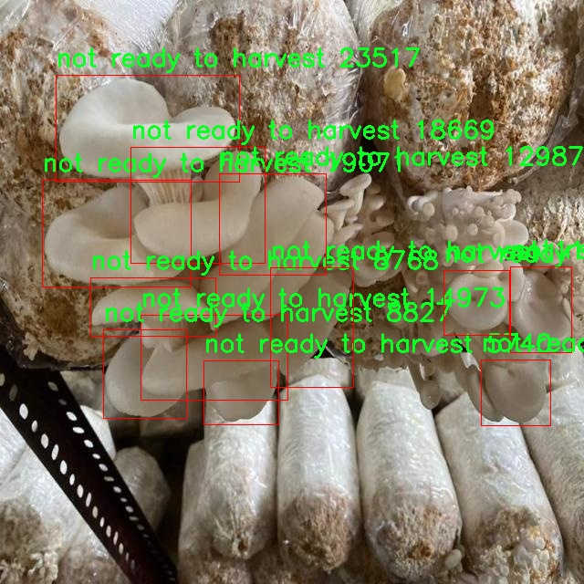
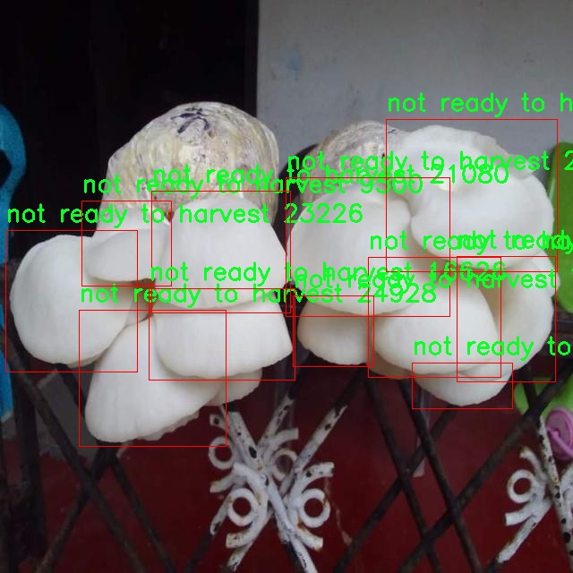
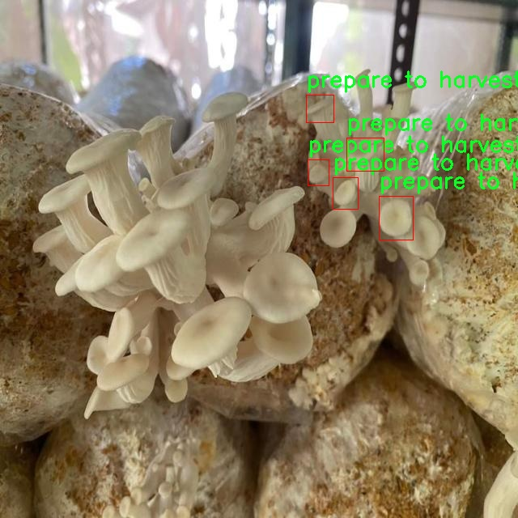
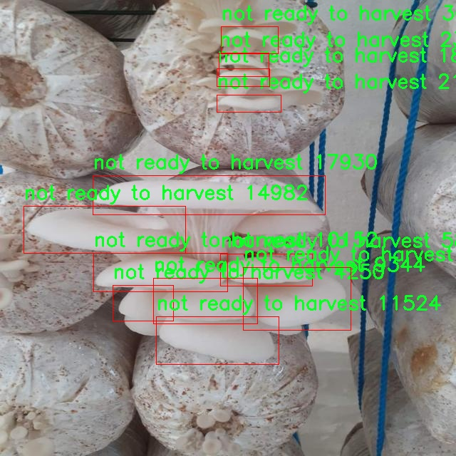
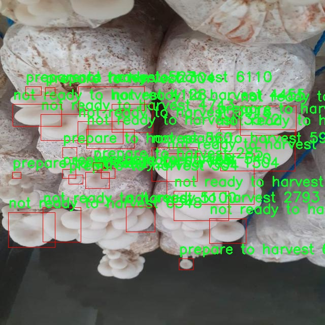

# 蘑菇成熟待收检测检测系统源码分享
 # [一条龙教学YOLOV8标注好的数据集一键训练_70+全套改进创新点发刊_Web前端展示]

### 1.研究背景与意义

项目参考[AAAI Association for the Advancement of Artificial Intelligence](https://gitee.com/qunmasj/projects)

项目来源[AACV Association for the Advancement of Computer Vision](https://kdocs.cn/l/cszuIiCKVNis)

研究背景与意义

随着全球人口的不断增长，食品安全和农业生产效率的问题日益凸显。在这一背景下，智能农业技术的应用逐渐成为提升农业生产力的重要手段。蘑菇作为一种营养丰富、经济价值高的农作物，其生产过程中的成熟度检测尤为关键。传统的人工检测方法不仅耗时耗力，而且容易受到主观因素的影响，导致检测结果的不准确性。因此，基于计算机视觉和深度学习技术的自动化检测系统应运而生，成为提升蘑菇生产效率和保证食品安全的重要工具。

本研究聚焦于基于改进YOLOv8的蘑菇成熟待收检测系统，旨在通过深度学习技术实现对蘑菇成熟度的自动化识别。YOLO（You Only Look Once）系列模型以其高效的实时目标检测能力在计算机视觉领域得到了广泛应用。YOLOv8作为该系列的最新版本，具备更高的检测精度和更快的处理速度，适合在农业生产中应用。通过对YOLOv8模型的改进，我们希望能够进一步提升其在蘑菇成熟度检测中的表现，使其能够在复杂的环境中准确识别不同成熟阶段的蘑菇。

在本研究中，我们使用了包含2200张图像的蘑菇数据集，数据集涵盖了三个成熟度类别：未成熟、准备收获和成熟。这一数据集的构建为模型的训练和验证提供了丰富的样本基础，使得模型能够学习到不同成熟阶段蘑菇的特征。通过对这些图像的分析，模型不仅能够识别出蘑菇的外观特征，还能根据颜色、形状等信息判断其成熟度。这一过程的自动化将大大提高蘑菇生产的效率，减少人工成本，同时降低因人为因素导致的误判风险。

此外，随着智能农业的快速发展，相关技术的应用也在不断扩展。基于深度学习的图像识别技术不仅可以应用于蘑菇的成熟度检测，还可以推广到其他农作物的生长监测、病虫害识别等领域。这将为农业生产的智能化转型提供强有力的技术支持，推动农业的可持续发展。

综上所述，本研究不仅具有重要的理论意义，也具备广泛的应用前景。通过构建基于改进YOLOv8的蘑菇成熟待收检测系统，我们期望能够为农业生产提供一种高效、准确的解决方案，助力智能农业的发展。同时，本研究也为未来在其他农作物检测领域的研究提供了参考和借鉴，推动计算机视觉技术在农业中的深入应用。

### 2.图片演示







##### 注意：由于此博客编辑较早，上面“2.图片演示”和“3.视频演示”展示的系统图片或者视频可能为老版本，新版本在老版本的基础上升级如下：（实际效果以升级的新版本为准）

  （1）适配了YOLOV8的“目标检测”模型和“实例分割”模型，通过加载相应的权重（.pt）文件即可自适应加载模型。

  （2）支持“图片识别”、“视频识别”、“摄像头实时识别”三种识别模式。

  （3）支持“图片识别”、“视频识别”、“摄像头实时识别”三种识别结果保存导出，解决手动导出（容易卡顿出现爆内存）存在的问题，识别完自动保存结果并导出到tempDir中。

  （4）支持Web前端系统中的标题、背景图等自定义修改，后面提供修改教程。

  另外本项目提供训练的数据集和训练教程,暂不提供权重文件（best.pt）,需要您按照教程进行训练后实现图片演示和Web前端界面演示的效果。

### 3.视频演示

[3.1 视频演示](https://www.bilibili.com/video/BV1R1sSeQEVY/)

### 4.数据集信息展示

##### 4.1 本项目数据集详细数据（类别数＆类别名）

nc: 3
names: ['not ready to harvest', 'prepare to harvest', 'ready to harvest']


##### 4.2 本项目数据集信息介绍

数据集信息展示

在本研究中，我们采用了名为“Oyster Mushroom”的数据集，以训练和改进YOLOv8模型，旨在实现蘑菇成熟待收检测系统的高效性和准确性。该数据集专注于对不同成熟阶段的牡蛎蘑菇进行分类，具体包括三个主要类别：未成熟（not ready to harvest）、准备收割（prepare to harvest）和成熟（ready to harvest）。这些类别的划分不仅反映了蘑菇生长的不同阶段，也为农民和农业工作者提供了科学依据，以便于他们在最佳时机进行收割，从而提高产量和质量。

“Oyster Mushroom”数据集的构建过程涵盖了多种采集方式，包括实地拍摄和实验室环境下的图像捕捉。数据集中的图像均为高分辨率，确保了在模型训练过程中能够提取到丰富的特征信息。每个类别的样本数量经过精心设计，以保证模型在学习过程中能够充分接触到每种状态的特征，从而提高分类的准确性和鲁棒性。

在数据集的标注过程中，研究团队采用了严格的标准，确保每张图像都被准确地标记为相应的成熟阶段。这一过程不仅依赖于人工标注，还结合了图像处理技术，以减少人为错误的可能性。通过这样的方式，数据集的质量得到了有效保障，为后续的模型训练奠定了坚实的基础。

随着深度学习技术的不断发展，YOLO系列模型因其在实时目标检测中的优越性能而受到广泛关注。YOLOv8作为该系列的最新版本，具有更强的特征提取能力和更快的推理速度。通过使用“Oyster Mushroom”数据集，我们旨在优化YOLOv8的参数设置和网络结构，使其能够更准确地识别和分类不同成熟阶段的牡蛎蘑菇。这不仅能够提高检测的精度，还能在实际应用中实现实时监测，帮助农民更好地管理他们的作物。

在实验过程中，我们将采用交叉验证的方法，以确保模型的泛化能力。数据集中的图像将被随机分为训练集、验证集和测试集，确保每个阶段的样本均衡分布。通过对模型在不同数据集上的表现进行评估，我们将能够全面了解其在实际应用中的效果。此外，模型的训练过程将结合数据增强技术，以进一步提升其对环境变化的适应能力。

总之，“Oyster Mushroom”数据集不仅为YOLOv8模型的训练提供了丰富的样本和准确的标注，还为农业领域的智能化发展贡献了重要的数据支持。通过本研究，我们希望能够实现对蘑菇成熟状态的高效检测，进而推动农业生产的现代化和智能化进程。











### 5.全套项目环境部署视频教程（零基础手把手教学）

[5.1 环境部署教程链接（零基础手把手教学）](https://www.ixigua.com/7404473917358506534?logTag=c807d0cbc21c0ef59de5)


[5.2 安装Python虚拟环境创建和依赖库安装视频教程链接（零基础手把手教学）](https://www.ixigua.com/7404474678003106304?logTag=1f1041108cd1f708b01a)

### 6.手把手YOLOV8训练视频教程（零基础小白有手就能学会）

[6.1 手把手YOLOV8训练视频教程（零基础小白有手就能学会）](https://www.ixigua.com/7404477157818401292?logTag=d31a2dfd1983c9668658)

### 7.70+种全套YOLOV8创新点代码加载调参视频教程（一键加载写好的改进模型的配置文件）

[7.1 70+种全套YOLOV8创新点代码加载调参视频教程（一键加载写好的改进模型的配置文件）](https://www.ixigua.com/7404478314661806627?logTag=29066f8288e3f4eea3a4)

### 8.70+种全套YOLOV8创新点原理讲解（非科班也可以轻松写刊发刊，V10版本正在科研待更新）

由于篇幅限制，每个创新点的具体原理讲解就不一一展开，具体见下列网址中的创新点对应子项目的技术原理博客网址【Blog】：


[8.1 70+种全套YOLOV8创新点原理讲解链接](https://gitee.com/qunmasj/good)

### 9.系统功能展示（检测对象为举例，实际内容以本项目数据集为准）

图9.1.系统支持检测结果表格显示

  图9.2.系统支持置信度和IOU阈值手动调节

  图9.3.系统支持自定义加载权重文件best.pt(需要你通过步骤5中训练获得)

  图9.4.系统支持摄像头实时识别

  图9.5.系统支持图片识别

  图9.6.系统支持视频识别

  图9.7.系统支持识别结果文件自动保存

  图9.8.系统支持Excel导出检测结果数据


### 10.原始YOLOV8算法原理

原始YOLOv8算法原理

YOLOv8作为YOLO系列的最新版本，代表了目标检测领域中的一项重要进展。它在YOLOv5的基础上进行了多方面的优化，旨在提升检测精度和速度，使其在各种应用场景中都能表现出色。YOLOv8的设计理念围绕着实时性和准确性展开，采用了创新的网络结构和算法策略，使其在复杂环境下的目标检测能力显著增强。

YOLOv8的网络结构可以分为四个主要部分：输入端、骨干网络、颈部网络和头部网络。输入端的设计考虑到了数据增强和模型的灵活性，采用了马赛克数据增强技术，这种方法通过将多张图像拼接在一起，生成多样化的训练样本，从而提升模型的泛化能力。此外，YOLOv8引入了自适应锚框计算和自适应灰度填充，进一步优化了输入数据的处理方式，使得模型能够更好地适应不同的输入图像特征。

在骨干网络部分，YOLOv8采用了C2f模块和空间金字塔池化（SPPF）结构。C2f模块是YOLOv8的核心组成部分，它通过残差连接和多分支结构增强了梯度流动性，提升了特征表示能力。这种设计使得模型在提取图像特征时能够更有效地捕捉到细节信息，从而提高了检测的准确性。SPPF模块则通过多尺度特征融合，增强了模型对不同尺寸目标的检测能力，确保了在复杂场景下的鲁棒性。

颈部网络采用了路径聚合网络（PAN）结构，旨在进一步提升特征融合的效果。PAN通过将来自不同尺度的特征图进行有效整合，使得模型能够更好地捕捉到不同大小目标的特征信息。这种多尺度特征融合的策略，确保了YOLOv8在面对各种尺寸的目标时，依然能够保持高效的检测性能。

头部网络是YOLOv8的最后一环，负责最终的目标检测和分类任务。与以往版本不同，YOLOv8在头部网络中将分类和检测过程进行了有效解耦，采用了新的损失计算策略。这一策略不仅提升了模型的训练效率，还优化了目标检测的准确性。具体而言，YOLOv8使用了Task-Aligned Assigner分配策略，根据分类与回归的分数加权结果选择正样本，确保了模型在训练过程中能够更好地学习到目标的特征。此外，分类分支采用了二元交叉熵损失（BCELoss），而回归分支则结合了分布焦点损失（DFLoss）和完全交并比损失函数（CIOULoss），这两者的结合使得模型在边界框预测方面的表现得到了显著提升。

YOLOv8的另一大创新在于其无锚框检测头的引入。传统的锚框方法在目标检测中虽然有效，但也带来了预测数量的增加和计算复杂度的提升。YOLOv8通过采用Anchor-Free的检测策略，减少了锚框的预测数量，进而加速了非最大抑制（NMS）过程，提高了整体的检测速度。这一改进使得YOLOv8在实时性要求较高的应用场景中，依然能够保持良好的性能。

此外，YOLOv8的设计还考虑到了模型的轻量化。通过对不同尺度模型调整通道数和结构，YOLOv8实现了更为精简的模型设计，确保了在保证检测精度的同时，模型的计算资源消耗得以控制。这种轻量化的设计理念，使得YOLOv8能够在移动设备和边缘计算环境中得以广泛应用，进一步拓展了其应用场景。

总的来说，YOLOv8在多个方面进行了创新和优化，使其在目标检测领域中展现出卓越的性能。通过引入新的网络结构、优化损失计算策略以及采用无锚框检测方法，YOLOv8不仅提升了检测精度，还加快了处理速度，适应了现代应用对实时性和准确性的双重需求。随着YOLOv8的发布，目标检测技术的应用范围将进一步扩大，推动相关领域的发展。无论是在智能监控、自动驾驶还是人脸识别等领域，YOLOv8都将发挥重要作用，为各类应用提供强有力的技术支持。


### 11.项目核心源码讲解（再也不用担心看不懂代码逻辑）

#### 11.1 ui.py

以下是对给定代码的核心部分进行提炼和详细注释的版本：

```python
import sys
import subprocess

def run_script(script_path):
    """
    使用当前 Python 环境运行指定的脚本。

    Args:
        script_path (str): 要运行的脚本路径

    Returns:
        None
    """
    # 获取当前 Python 解释器的路径
    python_path = sys.executable

    # 构建运行命令，使用 streamlit 运行指定的脚本
    command = f'"{python_path}" -m streamlit run "{script_path}"'

    # 执行命令
    result = subprocess.run(command, shell=True)
    
    # 检查命令执行结果，如果返回码不为0，表示出错
    if result.returncode != 0:
        print("脚本运行出错。")

# 主程序入口
if __name__ == "__main__":
    # 指定要运行的脚本路径
    script_path = "web.py"  # 假设脚本在当前目录下

    # 调用函数运行脚本
    run_script(script_path)
```

### 代码注释说明：

1. **导入模块**：
   - `sys`：用于访问与 Python 解释器相关的变量和函数。
   - `subprocess`：用于执行外部命令。

2. **`run_script` 函数**：
   - 功能：运行指定路径的 Python 脚本。
   - 参数：`script_path`，需要运行的脚本的路径。
   - 过程：
     - 获取当前 Python 解释器的路径，确保使用的是当前环境的 Python。
     - 构建一个命令字符串，使用 `streamlit` 运行指定的脚本。
     - 使用 `subprocess.run` 执行命令，并检查返回码以判断是否成功。

3. **主程序入口**：
   - 通过 `if __name__ == "__main__":` 确保该代码块仅在直接运行该脚本时执行。
   - 指定要运行的脚本路径（这里假设为 `web.py`）。
   - 调用 `run_script` 函数来执行指定的脚本。 

这个简化后的代码保留了核心功能，并且通过注释解释了每个部分的作用。

这个程序文件 `ui.py` 是一个用于运行指定 Python 脚本的工具，主要是通过 Streamlit 框架来启动一个 Web 应用。首先，文件导入了必要的模块，包括 `sys`、`os` 和 `subprocess`，其中 `sys` 用于访问与 Python 解释器相关的变量和函数，`subprocess` 则用于执行外部命令。

在 `run_script` 函数中，首先定义了一个参数 `script_path`，它表示要运行的脚本的路径。函数内部通过 `sys.executable` 获取当前 Python 解释器的路径，以确保在正确的环境中运行脚本。接着，构建了一个命令字符串，使用了 Streamlit 的运行命令格式。这个命令将会在命令行中执行。

使用 `subprocess.run` 方法来执行构建好的命令，并通过 `shell=True` 参数允许在 shell 中执行该命令。执行完命令后，检查返回码 `result.returncode`，如果不为零，表示脚本运行出错，程序会打印出错误信息。

在文件的最后部分，使用 `if __name__ == "__main__":` 语句来确保只有在直接运行该文件时才会执行后面的代码。这里指定了要运行的脚本路径为 `web.py`，并调用 `run_script` 函数来启动这个脚本。

总的来说，这个文件的主要功能是通过 Streamlit 框架运行一个名为 `web.py` 的 Python 脚本，并处理可能出现的错误。

#### 11.2 70+种YOLOv8算法改进源码大全和调试加载训练教程（非必要）\ultralytics\models\__init__.py

以下是代码中最核心的部分，并附上详细的中文注释：

```python
# 导入所需的模块
from .rtdetr import RTDETR  # 从当前包中导入 RTDETR 类
from .sam import SAM        # 从当前包中导入 SAM 类
from .yolo import YOLO      # 从当前包中导入 YOLO 类

# 定义可供外部使用的模块列表
__all__ = 'YOLO', 'RTDETR', 'SAM'  # 允许简化导入，只导出 YOLO、RTDETR 和 SAM 这三个类
```

### 注释说明：
1. **模块导入**：
   - 代码通过相对导入的方式引入了三个类：`RTDETR`、`SAM` 和 `YOLO`。这些类可能是实现目标检测或相关功能的核心组件。

2. **`__all__` 变量**：
   - `__all__` 是一个特殊变量，用于定义在使用 `from module import *` 时，哪些名称会被导入。这里指定了三个类，使得其他模块在导入时只会获取这三个类，而不会获取其他未列出的名称。这有助于控制模块的公共接口，避免不必要的名称冲突。

这个程序文件是Ultralytics YOLO项目的一部分，主要用于定义和管理YOLO模型的导入。文件的开头包含了版权信息，表明该代码遵循AGPL-3.0许可证，这意味着它是开源的，用户可以自由使用和修改，但需要遵循相应的许可证条款。

接下来的代码通过相对导入的方式引入了三个模块：RTDETR、SAM和YOLO。这些模块可能分别实现了不同的目标检测算法或功能，RTDETR和SAM可能是YOLO的改进版本或扩展功能。通过这种方式，用户可以在其他文件中方便地使用这些模型，而不需要每次都写出完整的模块路径。

最后，`__all__`变量被定义为一个包含字符串的元组，列出了可以被外部导入的名称。这意味着当使用`from ultralytics.models import *`时，只会导入YOLO、RTDETR和SAM这三个模型，从而简化了导入过程，提高了代码的可读性和可维护性。整体来看，这个文件的设计旨在提高模块的组织性和可用性，使得用户在使用YOLO相关功能时更加方便。

#### 11.3 code\model.py

以下是经过简化和详细注释的核心代码部分：

```python
# -*- coding: utf-8 -*-
import cv2  # 导入OpenCV库，用于处理图像和视频
import torch  # 导入PyTorch库，用于深度学习模型的处理
from ultralytics import YOLO  # 从ultralytics库中导入YOLO类，用于加载YOLO模型
from ultralytics.utils.torch_utils import select_device  # 导入设备选择工具

# 选择计算设备，优先使用GPU
device = "cuda:0" if torch.cuda.is_available() else "cpu"

# 初始化参数字典
ini_params = {
    'device': device,  # 设备类型
    'conf': 0.25,  # 物体置信度阈值
    'iou': 0.5,  # IOU阈值，用于非极大值抑制
    'classes': None,  # 类别过滤器
    'verbose': False  # 是否详细输出
}

class Web_Detector:  # 定义检测器类
    def __init__(self, params=None):  # 构造函数
        self.model = None  # 初始化模型为None
        self.img = None  # 初始化图像为None
        self.params = params if params else ini_params  # 使用提供的参数或默认参数

    def load_model(self, model_path):  # 加载模型的方法
        self.device = select_device(self.params['device'])  # 选择计算设备
        task = 'segment' if os.path.basename(model_path)[:3] == 'seg' else 'detect'  # 根据模型路径判断任务类型
        self.model = YOLO(model_path, task=task)  # 加载YOLO模型
        # 预热模型以提高后续推理速度
        self.model(torch.zeros(1, 3, 640, 640).to(self.device).type_as(next(self.model.model.parameters())))

    def preprocess(self, img):  # 图像预处理方法
        self.img = img  # 保存原始图像
        return img  # 返回处理后的图像

    def predict(self, img):  # 预测方法
        results = self.model(img, **ini_params)  # 使用模型进行预测
        return results  # 返回预测结果

    def postprocess(self, pred):  # 后处理方法
        results = []  # 初始化结果列表
        for res in pred[0].boxes:  # 遍历预测结果中的每个边界框
            for box in res:  # 对每个边界框进行处理
                class_id = int(box.cls.cpu())  # 获取类别ID
                bbox = box.xyxy.cpu().squeeze().tolist()  # 获取边界框坐标
                bbox = [int(coord) for coord in bbox]  # 转换为整数

                result = {
                    "class_name": self.names[class_id],  # 类别名称
                    "bbox": bbox,  # 边界框
                    "score": box.conf.cpu().squeeze().item(),  # 置信度
                    "class_id": class_id  # 类别ID
                }
                results.append(result)  # 将结果添加到列表
        return results  # 返回结果列表
```

### 代码注释说明：
1. **导入库**：引入必要的库以支持图像处理和深度学习模型的使用。
2. **设备选择**：根据系统是否支持CUDA来选择计算设备（GPU或CPU）。
3. **初始化参数**：定义模型的基本参数，包括置信度阈值和IOU阈值。
4. **Web_Detector类**：封装了YOLO模型的加载、预处理、预测和后处理功能。
5. **load_model方法**：根据模型路径加载YOLO模型，并进行预热以提高性能。
6. **preprocess方法**：处理输入图像，保存原始图像以备后用。
7. **predict方法**：使用加载的模型对输入图像进行预测，返回预测结果。
8. **postprocess方法**：对预测结果进行后处理，提取类别名称、边界框和置信度等信息，并将结果存储在列表中返回。

这个程序文件主要实现了一个基于YOLO模型的目标检测器，利用OpenCV和PyTorch等库进行图像处理和模型推理。程序首先导入了必要的库，包括OpenCV用于图像和视频处理，PyTorch用于深度学习模型的操作，以及QtFusion和Ultralytics库中的相关类和函数。

程序中定义了一些初始化参数，如设备类型（CPU或GPU）、物体置信度阈值、IOU阈值和类别过滤器等。接着，定义了一个`count_classes`函数，用于统计检测结果中每个类别的数量。该函数接收检测信息和类别名称列表，返回每个类别的计数。

接下来，定义了一个名为`Web_Detector`的类，该类继承自`Detector`抽象基类。构造函数中，初始化了一些属性，包括模型、图像和类别名称。`load_model`方法用于加载YOLO模型，并根据模型路径判断任务类型（检测或分割）。在加载模型后，会将类别名称转换为中文，并进行模型的预热操作。

`preprocess`方法用于对输入图像进行预处理，简单地保存原始图像并返回。`predict`方法则使用加载的模型对图像进行预测，返回预测结果。`postprocess`方法负责对预测结果进行后处理，将检测到的目标信息（如类别名称、边界框、置信度等）整理成字典形式，并存储在结果列表中。

最后，`set_param`方法用于更新检测器的参数。整体来看，这个程序文件实现了一个完整的目标检测流程，包括模型加载、图像预处理、目标预测和结果后处理，适用于需要进行目标检测的应用场景。

#### 11.4 train.py

以下是经过简化并注释的核心代码部分：

```python
import random
import numpy as np
import torch.nn as nn
from ultralytics.data import build_dataloader, build_yolo_dataset
from ultralytics.engine.trainer import BaseTrainer
from ultralytics.models import yolo
from ultralytics.nn.tasks import DetectionModel
from ultralytics.utils import LOGGER, RANK
from ultralytics.utils.torch_utils import de_parallel, torch_distributed_zero_first

class DetectionTrainer(BaseTrainer):
    """
    基于检测模型的训练类，继承自BaseTrainer类。
    """

    def build_dataset(self, img_path, mode="train", batch=None):
        """
        构建YOLO数据集。

        参数:
            img_path (str): 包含图像的文件夹路径。
            mode (str): 模式，可以是'train'或'val'，用于自定义不同的增强方法。
            batch (int, optional): 批次大小，适用于'rect'模式。默认为None。
        """
        gs = max(int(de_parallel(self.model).stride.max() if self.model else 0), 32)
        return build_yolo_dataset(self.args, img_path, batch, self.data, mode=mode, rect=mode == "val", stride=gs)

    def get_dataloader(self, dataset_path, batch_size=16, rank=0, mode="train"):
        """构建并返回数据加载器。"""
        assert mode in ["train", "val"]
        with torch_distributed_zero_first(rank):  # 仅在DDP时初始化数据集
            dataset = self.build_dataset(dataset_path, mode, batch_size)
        shuffle = mode == "train"  # 训练模式下打乱数据
        workers = self.args.workers if mode == "train" else self.args.workers * 2
        return build_dataloader(dataset, batch_size, workers, shuffle, rank)  # 返回数据加载器

    def preprocess_batch(self, batch):
        """对图像批次进行预处理，包括缩放和转换为浮点数。"""
        batch["img"] = batch["img"].to(self.device, non_blocking=True).float() / 255  # 归一化图像
        if self.args.multi_scale:  # 如果启用多尺度
            imgs = batch["img"]
            sz = (
                random.randrange(self.args.imgsz * 0.5, self.args.imgsz * 1.5 + self.stride)
                // self.stride
                * self.stride
            )  # 随机选择新的图像大小
            sf = sz / max(imgs.shape[2:])  # 计算缩放因子
            if sf != 1:
                ns = [
                    math.ceil(x * sf / self.stride) * self.stride for x in imgs.shape[2:]
                ]  # 计算新的形状
                imgs = nn.functional.interpolate(imgs, size=ns, mode="bilinear", align_corners=False)  # 进行插值
            batch["img"] = imgs
        return batch

    def set_model_attributes(self):
        """设置模型的属性，包括类别数量和名称。"""
        self.model.nc = self.data["nc"]  # 将类别数量附加到模型
        self.model.names = self.data["names"]  # 将类别名称附加到模型
        self.model.args = self.args  # 将超参数附加到模型

    def get_model(self, cfg=None, weights=None, verbose=True):
        """返回YOLO检测模型。"""
        model = DetectionModel(cfg, nc=self.data["nc"], verbose=verbose and RANK == -1)
        if weights:
            model.load(weights)  # 加载权重
        return model

    def plot_training_samples(self, batch, ni):
        """绘制带有注释的训练样本。"""
        plot_images(
            images=batch["img"],
            batch_idx=batch["batch_idx"],
            cls=batch["cls"].squeeze(-1),
            bboxes=batch["bboxes"],
            paths=batch["im_file"],
            fname=self.save_dir / f"train_batch{ni}.jpg",
            on_plot=self.on_plot,
        )

    def plot_metrics(self):
        """从CSV文件绘制指标。"""
        plot_results(file=self.csv, on_plot=self.on_plot)  # 保存结果图
```

### 代码说明：
1. **类定义**：`DetectionTrainer`类用于训练YOLO检测模型，继承自`BaseTrainer`。
2. **数据集构建**：`build_dataset`方法用于根据给定的图像路径和模式构建YOLO数据集。
3. **数据加载器**：`get_dataloader`方法构建并返回数据加载器，支持训练和验证模式。
4. **批次预处理**：`preprocess_batch`方法对输入的图像批次进行归一化和多尺度处理。
5. **模型属性设置**：`set_model_attributes`方法将类别数量和名称等属性设置到模型中。
6. **模型获取**：`get_model`方法返回一个YOLO检测模型，并可选择加载预训练权重。
7. **绘图功能**：`plot_training_samples`和`plot_metrics`方法用于可视化训练样本和训练指标。

这个程序文件 `train.py` 是一个用于训练 YOLO（You Only Look Once）目标检测模型的实现，继承自 `BaseTrainer` 类。程序的主要功能是构建数据集、创建数据加载器、预处理图像、设置模型属性、获取模型、进行模型验证、记录损失、绘制训练进度和结果等。

首先，程序导入了必要的库和模块，包括数学运算、随机数生成、深度学习相关的 PyTorch 模块，以及 Ultralytics 提供的 YOLO 相关的工具和函数。

`DetectionTrainer` 类是这个程序的核心，负责处理与目标检测模型训练相关的所有操作。它提供了多个方法来实现不同的功能。`build_dataset` 方法用于构建 YOLO 数据集，接收图像路径、模式（训练或验证）和批量大小作为参数，并返回构建好的数据集。`get_dataloader` 方法则根据给定的数据集路径和批量大小构建数据加载器，支持分布式训练，并在训练模式下对数据进行洗牌。

在数据预处理方面，`preprocess_batch` 方法对图像批次进行缩放和转换为浮点数，确保图像的像素值在 0 到 1 之间，并根据需要调整图像的大小。`set_model_attributes` 方法用于设置模型的属性，包括类别数量和类别名称。

`get_model` 方法用于返回一个 YOLO 检测模型，支持加载预训练权重。`get_validator` 方法返回一个用于模型验证的检测验证器。`label_loss_items` 方法则用于返回带有标签的训练损失项的字典，便于监控训练过程中的损失情况。

此外，`progress_string` 方法返回一个格式化的字符串，显示训练进度，包括当前的 epoch、GPU 内存使用情况、损失值、实例数量和图像大小等信息。`plot_training_samples` 方法用于绘制训练样本及其标注，便于可视化训练数据的效果。最后，`plot_metrics` 和 `plot_training_labels` 方法分别用于绘制训练过程中的指标和创建带标签的训练图。

整体而言，这个程序文件实现了 YOLO 模型训练的各个环节，涵盖了数据处理、模型训练、验证和结果可视化等功能，为用户提供了一个完整的训练框架。

#### 11.5 code\ultralytics\hub\utils.py

以下是经过简化并添加详细中文注释的核心代码部分：

```python
import os
import random
import sys
import threading
import time
from pathlib import Path
import requests
from ultralytics.utils import (
    ENVIRONMENT,
    LOGGER,
    RANK,
    SETTINGS,
    ONLINE,
    __version__,
    is_git_dir,
    is_pip_package,
)

# 定义用于发送事件的URL
EVENTS_URL = "https://www.google-analytics.com/mp/collect?measurement_id=G-X8NCJYTQXM&api_secret=QLQrATrNSwGRFRLE-cbHJw"

class Events:
    """
    用于收集匿名事件分析的类。事件分析在设置中sync=True时启用，sync=False时禁用。
    """

    def __init__(self):
        """初始化Events对象，设置默认值。"""
        self.events = []  # 事件列表
        self.rate_limit = 60.0  # 事件发送的速率限制（秒）
        self.t = 0.0  # 速率限制计时器（秒）
        self.metadata = {
            "cli": Path(sys.argv[0]).name == "yolo",  # 检查是否通过CLI运行
            "install": "git" if is_git_dir() else "pip" if is_pip_package() else "other",  # 安装方式
            "python": ".".join(platform.python_version_tuple()[:2]),  # Python版本
            "version": __version__,  # 当前版本
            "env": ENVIRONMENT,  # 环境信息
            "session_id": round(random.random() * 1e15),  # 随机生成的会话ID
            "engagement_time_msec": 1000,  # 参与时间（毫秒）
        }
        # 判断是否启用事件收集
        self.enabled = (
            SETTINGS["sync"] and  # 是否同步
            RANK in (-1, 0) and  # 排名条件
            ONLINE and  # 是否在线
            (is_pip_package() or is_git_dir())  # 安装方式是否符合要求
        )

    def __call__(self, cfg):
        """
        尝试将新事件添加到事件列表，并在达到速率限制时发送事件。

        Args:
            cfg (IterableSimpleNamespace): 包含模式和任务信息的配置对象。
        """
        if not self.enabled:
            return  # 如果事件收集被禁用，则不执行任何操作

        # 尝试添加事件
        if len(self.events) < 25:  # 事件列表限制为25个事件
            params = {
                **self.metadata,
                "task": cfg.task,  # 任务信息
                "model": cfg.model if cfg.model in GITHUB_ASSETS_NAMES else "custom",  # 模型信息
            }
            if cfg.mode == "export":
                params["format"] = cfg.format  # 导出格式
            self.events.append({"name": cfg.mode, "params": params})  # 添加事件

        # 检查速率限制
        t = time.time()
        if (t - self.t) < self.rate_limit:
            return  # 如果时间未超过速率限制，则不发送

        # 超过速率限制，发送事件
        data = {"client_id": SETTINGS["uuid"], "events": self.events}  # 包含客户端ID和事件列表的数据
        smart_request("post", EVENTS_URL, json=data, retry=0, verbose=False)  # 发送POST请求

        # 重置事件列表和速率限制计时器
        self.events = []
        self.t = t

# 创建Events实例
events = Events()
```

### 代码注释说明：
1. **导入必要的库**：导入了操作系统、随机数、系统参数、线程、时间、路径处理、HTTP请求等模块。
2. **定义事件收集的URL**：用于发送事件数据的Google Analytics URL。
3. **Events类**：用于管理和发送事件的类。
   - **初始化方法**：设置事件列表、速率限制、元数据等，并根据条件判断是否启用事件收集。
   - **调用方法**：尝试添加事件到列表，并在达到速率限制时发送事件数据。
4. **创建Events实例**：实例化Events类以便在后续代码中使用。

这个程序文件是Ultralytics YOLO项目中的一个工具模块，主要用于处理与Ultralytics Hub的交互、HTTP请求以及事件分析等功能。首先，文件导入了一些必要的库，包括操作系统、网络请求、线程处理等。接着，定义了一些常量，如Hub API和Web的根地址，以及用于输出信息的前缀和帮助信息。

文件中定义了多个函数和一个类。`request_with_credentials`函数用于在Google Colab环境中进行带有凭证的AJAX请求。它首先检查当前环境是否为Colab，如果不是，则抛出异常。该函数使用JavaScript在浏览器中执行请求，并返回响应数据。

`requests_with_progress`函数用于执行HTTP请求，并在下载过程中显示进度条。它支持不同的HTTP方法，并根据响应的内容长度显示下载进度。

`smart_request`函数则是一个更为复杂的请求处理函数，支持重试机制和超时设置。它会在请求失败时根据指定的重试次数和超时限制进行重试，并可以选择在单独的线程中执行请求。该函数还可以显示请求的进度条，并在请求失败时提供详细的错误信息。

`Events`类用于收集匿名事件分析数据。它在初始化时设置了一些默认值，包括事件列表、速率限制和元数据。该类的实例在特定条件下启用，用于记录和发送事件数据。`__call__`方法用于添加新事件到事件列表，并在达到速率限制时发送事件数据。

最后，文件创建了一个`Events`类的实例，用于后续的事件记录和分析。整体来看，这个模块提供了多种实用的功能，旨在提升与Ultralytics Hub的交互效率和用户体验。

#### 11.6 70+种YOLOv8算法改进源码大全和调试加载训练教程（非必要）\ultralytics\models\fastsam\utils.py

以下是代码中最核心的部分，并附上详细的中文注释：

```python
import torch

def adjust_bboxes_to_image_border(boxes, image_shape, threshold=20):
    """
    调整边界框，使其在距离图像边界一定阈值内时贴合边界。

    参数:
        boxes (torch.Tensor): 边界框的坐标，形状为 (n, 4)
        image_shape (tuple): 图像的高度和宽度，形状为 (height, width)
        threshold (int): 像素阈值，默认值为20

    返回:
        adjusted_boxes (torch.Tensor): 调整后的边界框
    """

    # 获取图像的高度和宽度
    h, w = image_shape

    # 调整边界框的坐标
    boxes[boxes[:, 0] < threshold, 0] = 0  # 将左上角x坐标小于阈值的设置为0
    boxes[boxes[:, 1] < threshold, 1] = 0  # 将左上角y坐标小于阈值的设置为0
    boxes[boxes[:, 2] > w - threshold, 2] = w  # 将右下角x坐标大于图像宽度减去阈值的设置为图像宽度
    boxes[boxes[:, 3] > h - threshold, 3] = h  # 将右下角y坐标大于图像高度减去阈值的设置为图像高度
    return boxes


def bbox_iou(box1, boxes, iou_thres=0.9, image_shape=(640, 640), raw_output=False):
    """
    计算一个边界框与其他边界框的交并比（IoU）。

    参数:
        box1 (torch.Tensor): 目标边界框，形状为 (4, )
        boxes (torch.Tensor): 其他边界框，形状为 (n, 4)
        iou_thres (float): IoU阈值，默认值为0.9
        image_shape (tuple): 图像的高度和宽度，形状为 (height, width)
        raw_output (bool): 如果为True，返回原始IoU值而不是索引

    返回:
        high_iou_indices (torch.Tensor): IoU大于阈值的边界框索引
    """
    # 调整边界框以贴合图像边界
    boxes = adjust_bboxes_to_image_border(boxes, image_shape)

    # 计算交集的坐标
    x1 = torch.max(box1[0], boxes[:, 0])  # 交集左上角x坐标
    y1 = torch.max(box1[1], boxes[:, 1])  # 交集左上角y坐标
    x2 = torch.min(box1[2], boxes[:, 2])  # 交集右下角x坐标
    y2 = torch.min(box1[3], boxes[:, 3])  # 交集右下角y坐标

    # 计算交集的面积
    intersection = (x2 - x1).clamp(0) * (y2 - y1).clamp(0)

    # 计算两个边界框的面积
    box1_area = (box1[2] - box1[0]) * (box1[3] - box1[1])  # box1的面积
    box2_area = (boxes[:, 2] - boxes[:, 0]) * (boxes[:, 3] - boxes[:, 1])  # boxes的面积

    # 计算并集的面积
    union = box1_area + box2_area - intersection

    # 计算IoU
    iou = intersection / union  # IoU值，形状为 (n, )
    
    if raw_output:
        return 0 if iou.numel() == 0 else iou  # 如果需要原始IoU值，则返回

    # 返回IoU大于阈值的边界框索引
    return torch.nonzero(iou > iou_thres).flatten()
```

### 代码核心部分解释：
1. **`adjust_bboxes_to_image_border` 函数**：该函数用于调整边界框的位置，使其在距离图像边界一定阈值内时贴合边界。它通过比较边界框的坐标与阈值，确保边界框不会超出图像的边界。

2. **`bbox_iou` 函数**：该函数计算一个边界框与其他边界框之间的交并比（IoU）。首先，它会调用 `adjust_bboxes_to_image_border` 函数来调整边界框，然后计算交集和并集的面积，最后返回IoU值大于指定阈值的边界框的索引。这个函数是目标检测中非常重要的部分，用于评估检测结果的准确性。

该程序文件是一个用于YOLO（You Only Look Once）目标检测算法的工具模块，主要包含两个函数，分别用于调整边界框和计算交并比（IoU）。

首先，`adjust_bboxes_to_image_border`函数的作用是调整给定的边界框，使其在接近图像边界时不会超出图像的范围。该函数接收三个参数：`boxes`是一个形状为(n, 4)的张量，表示n个边界框的坐标；`image_shape`是一个元组，包含图像的高度和宽度；`threshold`是一个整数，表示距离图像边界的阈值。函数内部首先获取图像的高度和宽度，然后通过条件判断调整边界框的坐标。如果边界框的左上角坐标(x1, y1)小于阈值，则将其调整为0；如果右下角坐标(x2, y2)超过图像的边界，则将其调整为图像的宽度或高度。最后，返回调整后的边界框。

接下来的`bbox_iou`函数用于计算一个边界框与一组其他边界框之间的交并比。该函数接受多个参数，其中`box1`是待计算的边界框，`boxes`是其他边界框的集合，`iou_thres`是IoU的阈值，`image_shape`是图像的尺寸，`raw_output`是一个布尔值，指示是否返回原始的IoU值。函数首先调用`adjust_bboxes_to_image_border`来确保所有边界框都在图像边界内。接着，计算交集的坐标，并利用这些坐标计算交集的面积。然后，计算每个边界框的面积，并根据交集面积和两个边界框的面积计算并集。最后，计算IoU值，并根据`raw_output`的值决定返回原始的IoU值还是满足阈值条件的边界框索引。

总体来说，这个文件提供了边界框处理和IoU计算的基础功能，为YOLO目标检测算法的实现提供了重要的支持。

### 12.系统整体结构（节选）

### 整体功能和构架概括

该项目是一个基于YOLO（You Only Look Once）目标检测算法的实现，主要用于目标检测和相关任务的训练、推理和评估。项目结构清晰，包含多个模块和工具，旨在提供一个完整的目标检测解决方案。各个文件分别承担不同的功能，包括模型的定义、训练过程的管理、数据处理、结果可视化以及与Ultralytics Hub的交互等。

- **模型定义**：包括YOLO及其变种的实现，提供了灵活的模型架构。
- **训练管理**：负责数据集的构建、训练过程的监控和模型的验证。
- **工具函数**：提供了各种实用的工具函数，用于边界框处理、IoU计算、HTTP请求等。
- **用户界面**：通过UI模块提供了与用户的交互界面，方便用户启动和配置训练过程。

### 文件功能整理表

| 文件路径                                                                                              | 功能描述                                                                                   |
|-----------------------------------------------------------------------------------------------------|------------------------------------------------------------------------------------------|
| `ui.py`                                                                                             | 启动和运行YOLO模型的Web应用，处理脚本执行和错误信息。                                      |
| `70+种YOLOv8算法改进源码大全和调试加载训练教程（非必要）\ultralytics\models\__init__.py`            | 定义模型模块的导入结构，方便其他模块使用YOLO、RTDETR和SAM模型。                          |
| `code\model.py`                                                                                    | 实现目标检测器，负责模型加载、图像预处理、预测和结果后处理。                             |
| `train.py`                                                                                         | 负责YOLO模型的训练过程，包括数据集构建、模型训练、验证和结果可视化。                     |
| `code\ultralytics\hub\utils.py`                                                                   | 提供与Ultralytics Hub的交互功能，包括HTTP请求、事件分析和进度显示。                     |
| `70+种YOLOv8算法改进源码大全和调试加载训练教程（非必要）\ultralytics\models\fastsam\utils.py`      | 提供边界框调整和IoU计算的工具函数，支持目标检测任务中的边界框处理。                     |
| `code\ultralytics\models\sam\modules\sam.py`                                                     | 实现SAM（Segment Anything Model）模块，提供分割功能的支持。                             |
| `code\ultralytics\utils\plotting.py`                                                              | 提供结果可视化功能，包括绘制训练过程中的指标和样本。                                     |
| `code\ultralytics\models\yolo\obb\val.py`                                                         | 实现YOLO模型的验证过程，计算模型在验证集上的性能指标。                                   |
| `70+种YOLOv8算法改进源码大全和调试加载训练教程（非必要）\ultralytics\models\nas\model.py`          | 实现NAS（Neural Architecture Search）模型，提供网络结构搜索的功能。                     |
| `70+种YOLOv8算法改进源码大全和调试加载训练教程（非必要）\ultralytics\models\fastsam\predict.py` | 实现SAM模型的预测功能，支持对输入图像进行分割和目标检测。                               |
| `70+种YOLOv8算法改进源码大全和调试加载训练教程（非必要）\ultralytics\nn\modules\conv.py`         | 实现卷积层及其相关操作，提供深度学习模型中的基本构建块。                                 |
| `code\ultralytics\engine\results.py`                                                              | 处理模型推理结果，提供结果的存储和分析功能。                                             |

这个表格总结了项目中各个文件的主要功能，展示了项目的模块化设计和功能分工。

注意：由于此博客编辑较早，上面“11.项目核心源码讲解（再也不用担心看不懂代码逻辑）”中部分代码可能会优化升级，仅供参考学习，完整“训练源码”、“Web前端界面”和“70+种创新点源码”以“13.完整训练+Web前端界面+70+种创新点源码、数据集获取”的内容为准。

### 13.完整训练+Web前端界面+70+种创新点源码、数据集获取


# [下载链接：https://mbd.pub/o/bread/ZpuYmZtu](https://mbd.pub/o/bread/ZpuYmZtu)